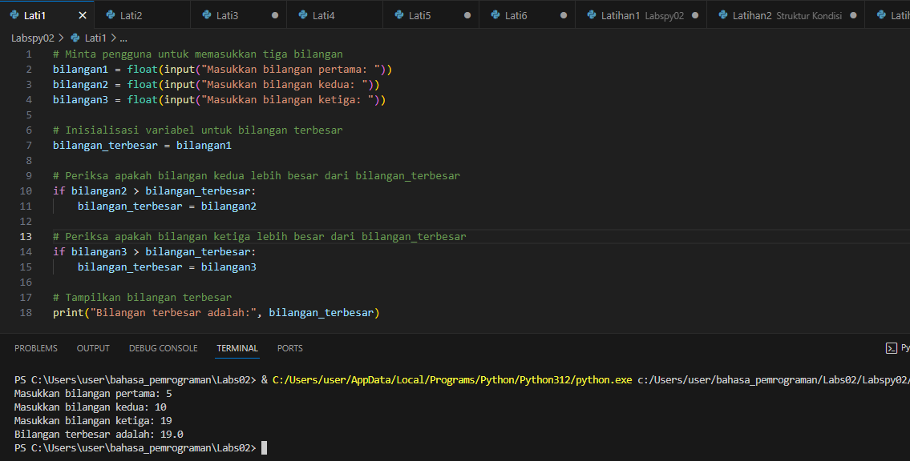
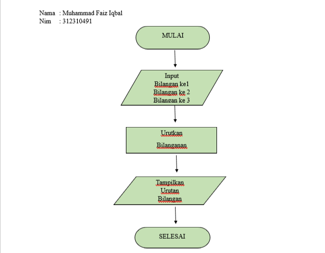
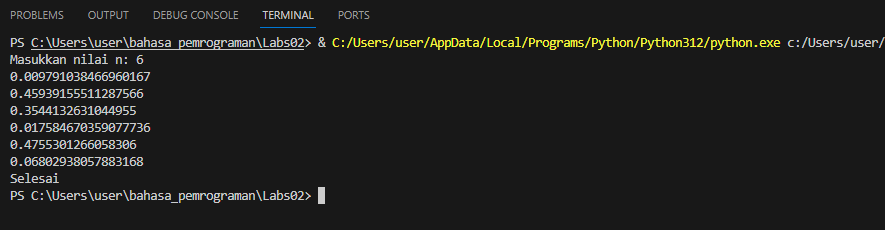
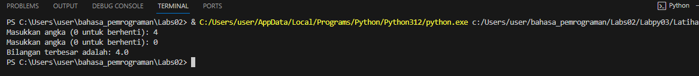
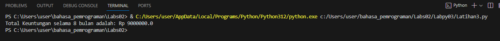
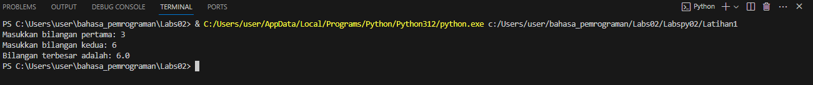
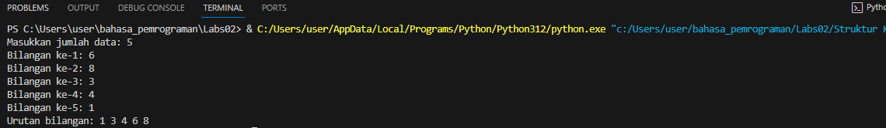
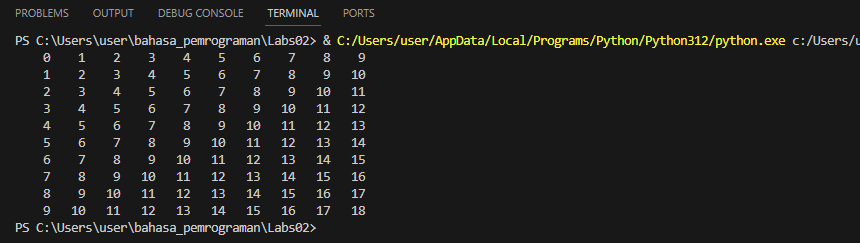
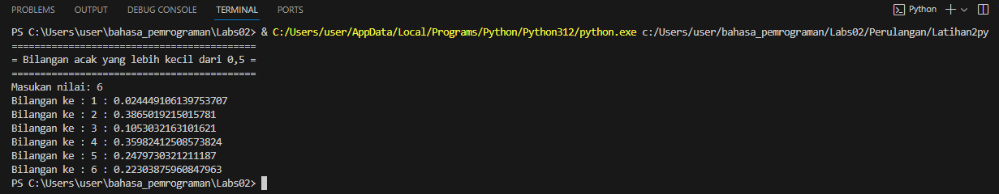

# Labspy2
## Pertama 
- program meminta pengguna untuk memasukkan tiga bilangan menggunakan input(), dan hasilnya disimpan dalam variabel bilangan1, bilangan2, dan bilangan3.
  Kemudian, program memeriksa tiga kondisi menggunakan if:
## pertama
- memeriksa apakah bilangan1 lebih besar dari bilangan2 dan bilangan3. Jika benar, maka bilangan1 adalah yang terbesar.
## kedua
- jika kondisi pertama salah, maka memeriksa apakah bilangan2 lebih besar dari bilangan1 dan bilangan3. Jika benar, maka bilangan2 adalah yang terbesar.
  Jika kedua kondisi sebelumnya salah, maka bilangan3 adalah yang terbesar.Hasil bilangan terbesar ditampilkan menggunakan pernyataan print.
## output

Dengan demikian, program akan menentukan bilangan terbesar di antara ketiga bilangan yang dimasukkan oleh pengguna dan mencetaknya ke layar.

### flowchart



# labspy03
## LATIHAN1 
- import random: Ini adalah pernyataan untuk mengimpor modul random, yang digunakan untuk menghasilkan bilangan acak.
- n = int(input("Masukkan nilai n: ")): Program ini meminta pengguna untuk memasukkan sebuah nilai n melalui keyboard. Nilai tersebut kemudian dikonversi menjadi integer 
  (bilangan bulat) dan disimpan dalam variabel n.
- count = 0: Variabel count diinisialisasi dengan nilai 0. Variabel ini akan digunakan sebagai penghitung untuk melacak berapa kali bilangan acak telah dihasilkan.
- while count < n:: Ini adalah awal dari loop while. Kode dalam loop ini akan dieksekusi selama nilai count kurang dari n.
- random_number = random.random(): Ini adalah pernyataan yang menghasilkan sebuah bilangan acak antara 0 dan 1 dengan menggunakan fungsi random.random() dari modul random. 
  Hasilnya disimpan dalam variabel random_number.
- if random_number < 0.5:: Program memeriksa apakah random_number kurang dari 0.5. Jika benar, maka bilangan tersebut akan dicetak.
- print(random_number): Jika bilangan acak memenuhi kondisi sebelumnya (kurang dari 0.5), maka bilangan tersebut akan dicetak ke layar.

````
import random

n = int(input("Masukkan nilai n: "))  # Meminta pengguna untuk memasukkan nilai n

count = 0  # Inisialisasi penghitung
while count < n:
    random_number = random.random()  # Menghasilkan bilangan acak antara 0 dan 1
    if random_number < 0.5:
        print(random_number)
        count += 1  # Menambahkan 1 ke penghitung

print("Selesai")


````
## OUTPUT


## LATIHAN 2 
- max_number = None: Variabel max_number diinisialisasi dengan nilai None. 
  Ini digunakan untuk menyimpan bilangan terbesar yang akan dicari nantinya.
- while True:: Ini adalah awal dari loop while yang akan berjalan tanpa 
  henti (selama kondisinya True), sehingga program akan terus meminta 
  pengguna untuk memasukkan bilangan.
- input_number = float(input("Masukkan angka (0 untuk berhenti): "): 
  Program meminta pengguna untuk memasukkan sebuah bilangan desimal. 
  Bilangan yang dimasukkan oleh pengguna disimpan dalam variabel 
  input_number setelah dikonversi menjadi float (bilangan riil).
- if input_number == 0:: Program memeriksa apakah bilangan yang dimasukkan 
  oleh pengguna adalah 0. Jika iya, maka program akan keluar dari loop 
  while 
  dengan pernyataan break, sehingga pengguna dapat menghentikan input 
  dengan 
 memasukkan 0.
- if max_number is None or input_number > max_number:: Program memeriksa 
  apakah nilai max_number saat ini adalah None (belum ada bilangan yang 
  dimasukkan sebelumnya) atau apakah input_number lebih besar dari 
  max_number yang sebelumnya. Jika salah satu kondisi ini terpenuhi, maka 
  max_number akan diubah menjadi input_number.

````
# Inisialisasi variabel untuk menyimpan bilangan terbesar
max_number = None

while True:
    input_number = float(input("Masukkan angka (0 untuk berhenti): "))

    # Cek apakah pengguna memasukkan 0
    if input_number == 0:
        break

    # Periksa apakah bilangan saat ini lebih besar dari yang sebelumnya
    if max_number is None or input_number > max_number:
        max_number = input_number

if max_number is not None:
    print("Bilangan terbesar adalah:", max_number)
else:
    print("Tidak ada bilangan yang dimasukkan.")


````


## OUTPUT


## PROGRAM 1 PY
- total_keuntungan += modal_awal * 0.01: Pada bulan 3, laba 1% dari modal awal ditambahkan ke total_keuntungan.
- total_keuntungan += modal_awal * 0.05: Pada bulan 5, laba 5% dari modal awal ditambahkan ke total_keuntungan.
- total_keuntungan += modal_awal * 0.03: Pada bulan 8, laba 3% dari modal awal ditambahkan ke total_keuntungan.
- print("Total Keuntungan selama 8 bulan adalah: Rp", total_keuntungan): Ini adalah perintah cetak yang digunakan untuk mencetak hasil perhitungan total keuntungan selama 8 
  bulan ke layar. Pesan ini juga mencantumkan jumlah keuntungan dalam bentuk mata uang (Rupiah).

````
# Modal awal
modal_awal = 100000000  # 100 juta

# Inisialisasi total keuntungan
total_keuntungan = 0

# Bulan 1 dan 2
total_keuntungan += 0  # Tidak ada laba pada bulan 1
total_keuntungan += 0  # Tidak ada laba pada bulan 2

# Bulan 3
total_keuntungan += modal_awal * 0.01  # Laba 1% dari modal awal

# Bulan 4
total_keuntungan += 0  # Tidak ada peningkatan laba

# Bulan 5
total_keuntungan += modal_awal * 0.05  # Laba 5% dari modal awal

# Bulan 6 dan 7
total_keuntungan += 0  # Tidak ada peningkatan laba pada bulan 6 dan 7

# Bulan 8
total_keuntungan += modal_awal * 0.03  # Laba 3% dari modal awal

# Total keuntungan selama 8 bulan
print("Total Keuntungan selama 8 bulan adalah: Rp", total_keuntungan)


````
  
## OUTPUT


## STRUKTUR KONDISI
## Latihan 1
````
# Minta pengguna untuk memasukkan dua bilangan
bilangan1 = float(input("Masukkan bilangan pertama: "))
bilangan2 = float(input("Masukkan bilangan kedua: "))

# Gunakan statement if untuk menentukan bilangan terbesar
if bilangan1 > bilangan2:
    terbesar = bilangan1
else:
    terbesar = bilangan2

# Tampilkan bilangan terbesar
print("Bilangan terbesar adalah:", terbesar)

````

## OUTPUT


## Latihan 2
````
# Meminta pengguna untuk memasukkan jumlah data
jumlah_data = int(input("Masukkan jumlah data: "))

# Membuat list untuk menyimpan data
data = []

# Mengisi list dengan data yang diinputkan
for i in range(1, jumlah_data + 1):
    bilangan = float(input(f"Bilangan ke-{i}: "))
    data.append(bilangan)

# Mengurutkan data
data.sort()

# Menampilkan hasil pengurutan tanpa angka di belakang titik desimal
print("Urutan bilangan:", end=" ")
for bilangan in data:
    print(int(bilangan), end=" ")

````
## OUTPUT


## PERULANGAN 
## Latihan 1
- kolom = baris: Variabel kolom juga diatur sama dengan baris. Ini berarti bahwa segitiga yang dihasilkan akan memiliki jumlah kolom yang sama dengan jumlah baris.
- Loop pertama (for bar in range(baris)) digunakan untuk mengiterasi melalui setiap baris dalam segitiga. Variabel bar akan berubah dari 0 hingga 9 (karena baris diatur ke 
  10).
- Loop kedua (for col in range(kolom)) digunakan untuk mengiterasi melalui setiap kolom dalam segitiga. Variabel col akan berubah dari 0 hingga 9.
- tab = bar + col: Variabel tab digunakan untuk menghitung jumlah baris dan kolom saat ini. Ini akan menghasilkan nilai yang bertambah secara berurutan dengan setiap baris 
dan kolom yang ditambahkan.

## OUTPUT


## Latihan 2
````
import random
print("===========================================")
print("= Bilangan acak yang lebih kecil dari 0,5 =")
print("===========================================")

jum = int( input("Masukan nilai: "))
i = 0
while i in range(jum):
    i += 1
    angkarandom = random.uniform(0,0.5)
    print("Bilangan ke :", i, " : ", angkarandom)


````
## OUTPUT


